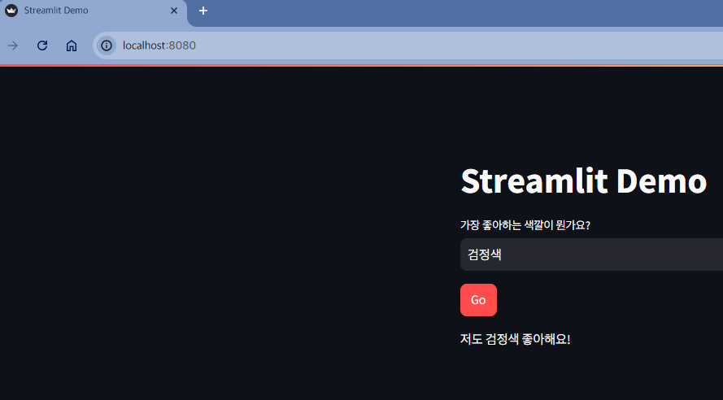

# Streamlit

- 오픈 소스 Python 프레임워크로 머신러닝 애플리케이션 데모를 위한 프론트엔드 환경을 구성
- 웹 요소를 표시하기 위한 명령어 라이브러리를 제공
- 생성형 AI 프로토타입을 제작하는 데 매우 적합
- Docs - <https://docs.streamlit.io/>

> Streamlit을 사용하면 비교적 적은 양의 Python 코드로 간단하고 매력적인 사용자 인터페이스를 구축할 수 있습니다. 백엔드 개발자의 경우, 프론트엔드 개발을 위한 다양한 프로그래밍 언어, 프레임워크, 호스팅 플랫폼을 배울 필요 없이 코드에 대한 데모 애플리케이션을 만들 수 있다는 뜻입니다. 프론트엔드 개발자의 경우에도 접근 방식을 검증하기 위한 PoC(개념 증명)를 신속하게 빌드할 수 있습니다.

## 테스트

```zsh
❯ streamlit run streamlit_app.py --server.port 8080  

      👋 Welcome to Streamlit!

      If you’d like to receive helpful onboarding emails, news, offers, promotions,
      and the occasional swag, please enter your email address below. Otherwise,
      leave this field blank.

      Email:  

  You can find our privacy policy at https://streamlit.io/privacy-policy

  Summary:
  - This open source library collects usage statistics.
  - We cannot see and do not store information contained inside Streamlit apps,
    such as text, charts, images, etc.
  - Telemetry data is stored in servers in the United States.
  - If you'd like to opt out, add the following to ~/.streamlit/config.toml,
    creating that file if necessary:

    [browser]
    gatherUsageStats = false


  You can now view your Streamlit app in your browser.

  Local URL: http://localhost:8080
  Network URL: http://172.28.8.232:8080

gio: http://localhost:8080: Operation not supported
```

## 확인
