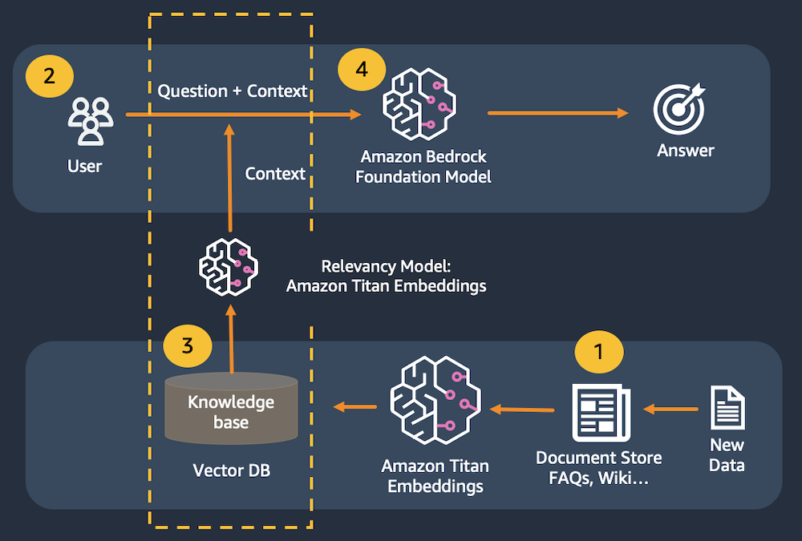
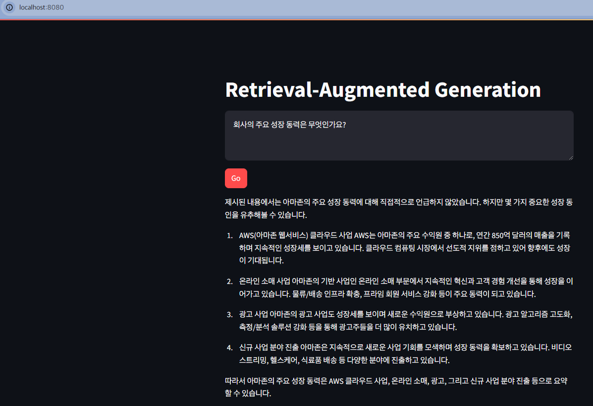

# 이미지 생성

Anthropic claude-v3, Titan Embeddings, LangChain 및 Streamlit을 사용하여 간단한 질의응답 애플리케이션



1. 문서가 텍스트 청크로 분할
2. 청크는 Titan 임베딩으로 전달되어 벡터로 변환
3. 벡터는 벡터 데이터베이스에 저장
4. 사용자가 질문을 제출
5. Titan 임베딩을 사용하여 질문을 벡터로 변환한 다음 벡터 데이터베이스에서 가장 가까운 벡터와 일치시킴
6. 매칭 벡터와 원래 질문의 결합된 콘텐츠를 대규모 언어 모델에 전달하여 최상의 답변 도출

## 검색 증강 생성(RAG - Retrieval-Augmented Generation)

- 대규모 언어 모델은 환각에 빠지기 쉬움.
- 질문에 정확하고 일관되게 답변하기 위해 모델에 응답을 뒷받침할 수 있는 실제 정보가 있는지 확인해야 함
- 이를 위해 RAG 패턴을 사용

## 테스트

```zsh
❯ streamlit run rag_app_kr.py --server.port 8080

  You can now view your Streamlit app in your browser.

  Local URL: http://localhost:8080
  Network URL: http://172.28.8.232:8080
```

## 확인

