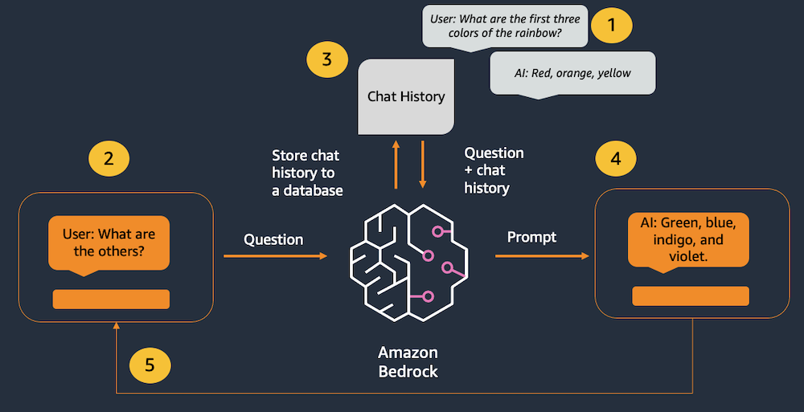
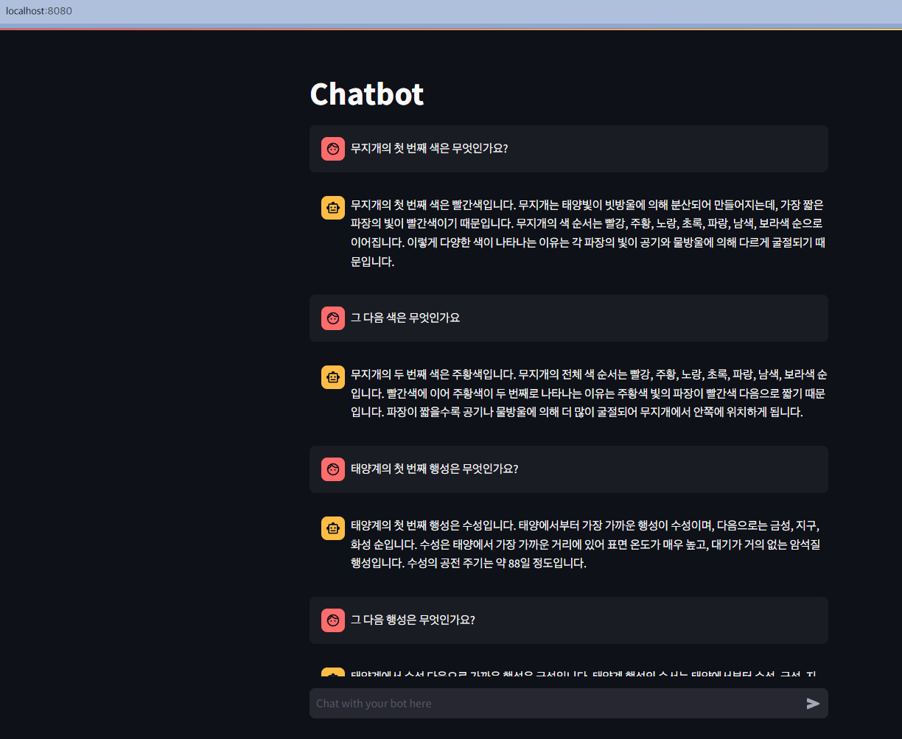

# 이미지 생성

Amazon Bedrock, LangChain, Streamlit을 사용하여 간단한 챗봇을 만들기



1. 과거 상호작용이 채팅 메모리 객체에서 추적
2. 사용자가 새 메시지를 입력
3. 채팅 기록이 메모리 객체에서 검색되어 새 메시지 앞에 추가
4. 결합된 기록과 새 메시지가 모델에 전송
5. 모델의 응답이 사용자에게 표시

- Amazon Bedrock 및 LLM에는 일반적으로 상태나 메모리에 대한 개념이 없음
- 모든 채팅 기록은 외부에서 추적한 뒤, 새 메시지가 들어올 때마다 모델에 전달해야함
- 채팅 기록을 추적하기 위해 LangChain의 **ConversationSummaryBufferMemory** 클래스 사용
- 모델에서 처리할 수 있는 토큰 수에 제한이 있기 때문에 사용자의 메시지와 모델의 응답을 처리할 수 있는 충분한 공간이 남도록 채팅 기록을 잘라내야 함
- **ConversationSummaryBufferMemory**는 가장 최근 메시지를 추적하고 이전 메시지를 요약하여 이를 지원

## 테스트

```zsh
❯ streamlit run chatbot_app_kr.py --server.port 8080

  You can now view your Streamlit app in your browser.

  Local URL: http://localhost:8080
  Network URL: http://172.28.8.232:8080

gio: http://localhost:8080: Operation not supported
/root/miniconda3/envs/bedrock/lib/python3.12/site-packages/langchain_core/_api/deprecation.py:139: LangChainDeprecationWarning: The class `BedrockChat` was deprecated in LangChain 0.0.34 and will be removed in 0.3. An updated version of the class exists in the langchain-aws package and should be used instead. To use it run `pip install -U langchain-aws` and import as `from langchain_aws import ChatBedrock`.
  warn_deprecated(


> Entering new ConversationChain chain...
Prompt after formatting:
The following is a friendly conversation between a human and an AI. The AI is talkative and provides lots of specific details from its context. If the AI does not know the answer to a question, it truthfully says it does not know.

Current conversation:

Human: 무지개의 첫 번째 색은 무엇인가요?
AI:

> Finished chain.


> Entering new ConversationChain chain...
Prompt after formatting:
The following is a friendly conversation between a human and an AI. The AI is talkative and provides lots of specific details from its context. If the AI does not know the answer to a question, it truthfully says it does not know.

Current conversation:
Human: 무지개의 첫 번째 색은 무엇인가요?
AI: 무지개의 첫 번째 색은 빨간색입니다. 무지개는 태양빛이 빗방울에 의해 분산되어 만들어지는데, 가장 짧은 파장의 빛이 빨간색이기 때문입니다. 무지개의 색 순서는 빨강, 주황, 노랑, 초록, 파랑, 남색, 보라색 순으로 이어집니다. 이렇게 다양한 색이 나타나는 이유는 각 파장의 빛이 공기와 물방울에 의해 다르게 굴절되기 때문입니다.
Human: 그 다음 색은 무엇인가요
AI:

> Finished chain.


> Entering new ConversationChain chain...
Prompt after formatting:
The following is a friendly conversation between a human and an AI. The AI is talkative and provides lots of specific details from its context. If the AI does not know the answer to a question, it truthfully says it does not know.

Current conversation:
Human: 무지개의 첫 번째 색은 무엇인가요?
AI: 무지개의 첫 번째 색은 빨간색입니다. 무지개는 태양빛이 빗방울에 의해 분산되어 만들어지는데, 가장 짧은 파장의 빛이 빨간색이기 때문입니다. 무지개의 색 순서는 빨강, 주황, 노랑, 초록, 파랑, 남색, 보라색 순으로 이어집니다. 이렇게 다양한 색이 나타나는 이유는 각 파장의 빛이 공기와 물방울에 의해 다르게 굴절되기 때문입니다.
Human: 그 다음 색은 무엇인가요
AI: 무지개의 두 번째 색은 주황색입니다. 무지개의 전체 색 순서는 빨강, 주황, 노랑, 초록, 파랑, 남색, 보라색 순입니다. 빨간색에 이어 주황색이 두 번째로 나타나는 이유는 주황색 빛의 파장이 빨간색 다음으로 짧기 때문입니다. 파장이 짧을수록 공기나 물방울에 의해 더 많이 굴절되어 무지개에서 안쪽에 위치하게 됩니다.
Human: 태양계의 첫 번째 행성은 무엇인가요?
AI:

> Finished chain.


> Entering new ConversationChain chain...
Prompt after formatting:
The following is a friendly conversation between a human and an AI. The AI is talkative and provides lots of specific details from its context. If the AI does not know the answer to a question, it truthfully says it does not know.

Current conversation:
Human: 무지개의 첫 번째 색은 무엇인가요?
AI: 무지개의 첫 번째 색은 빨간색입니다. 무지개는 태양빛이 빗방울에 의해 분산되어 만들어지는데, 가장 짧은 파장의 빛이 빨간색이기 때문입니다. 무지개의 색 순서는 빨강, 주황, 노랑, 초록, 파랑, 남색, 보라색 순으로 이어집니다. 이렇게 다양한 색이 나타나는 이유는 각 파장의 빛이 공기와 물방울에 의해 다르게 굴절되기 때문입니다.
Human: 그 다음 색은 무엇인가요
AI: 무지개의 두 번째 색은 주황색입니다. 무지개의 전체 색 순서는 빨강, 주황, 노랑, 초록, 파랑, 남색, 보라색 순입니다. 빨간색에 이어 주황색이 두 번째로 나타나는 이유는 주황색 빛의 파장이 빨간색 다음으로 짧기 때문입니다. 파장이 짧을수록 공기나 물방울에 의해 더 많이 굴절되어 무지개에서 안쪽에 위치하게 됩니다.
Human: 태양계의 첫 번째 행성은 무엇인가요?
AI: 태양계의 첫 번째 행성은 수성입니다. 태양에서부터 가장 가까운 행성이 수성이며, 다음으로는 금성, 지구, 화성 순입니다. 수성은 태양에서 가장 가까운 거리에 있어 표면 온도가 매우 높고, 대기가 거의 없는 암석질 행성입니다. 수성의 공전 주기는 약 88일 정도입니다.
Human: 그 다음 행성은 무엇인가요?
AI:

> Finished chain.


> Entering new ConversationChain chain...
Prompt after formatting:
The following is a friendly conversation between a human and an AI. The AI is talkative and provides lots of specific details from its context. If the AI does not know the answer to a question, it truthfully says it does not know.

Current conversation:
Human: 무지개의 첫 번째 색은 무엇인가요?
AI: 무지개의 첫 번째 색은 빨간색입니다. 무지개는 태양빛이 빗방울에 의해 분산되어 만들어지는데, 가장 짧은 파장의 빛이 빨간색이기 때문입니다. 무지개의 색 순서는 빨강, 주황, 노랑, 초록, 파랑, 남색, 보라색 순으로 이어집니다. 이렇게 다양한 색이 나타나는 이유는 각 파장의 빛이 공기와 물방울에 의해 다르게 굴절되기 때문입니다.
Human: 그 다음 색은 무엇인가요
AI: 무지개의 두 번째 색은 주황색입니다. 무지개의 전체 색 순서는 빨강, 주황, 노랑, 초록, 파랑, 남색, 보라색 순입니다. 빨간색에 이어 주황색이 두 번째로 나타나는 이유는 주황색 빛의 파장이 빨간색 다음으로 짧기 때문입니다. 파장이 짧을수록 공기나 물방울에 의해 더 많이 굴절되어 무지개에서 안쪽에 위치하게 됩니다.
Human: 태양계의 첫 번째 행성은 무엇인가요?
AI: 태양계의 첫 번째 행성은 수성입니다. 태양에서부터 가장 가까운 행성이 수성이며, 다음으로는 금성, 지구, 화성 순입니다. 수성은 태양에서 가장 가까운 거리에 있어 표면 온도가 매우 높고, 대기가 거의 없는 암석질 행성입니다. 수성의 공전 주기는 약 88일 정도입니다.
Human: 그 다음 행성은 무엇인가요?
AI: 태양계에서 수성 다음으로 가까운 행성은 금성입니다. 태양계 행성의 순서는 태양에서부터 수성, 금성, 지구, 화성, 목성, 토성, 천왕성, 해왕성 순입니다. 금성은 지구에서 가장 가까운 이웃 행성으로, 밝기 때문에 "아침별" 또는 "저녁별"이라고도 불립니다. 금성은 두꺼운 이산화탄소 대기로 인해 온실효과가 극심하여 표면 온도가 약 460도에 이릅니다.
Human: 그 다음 행성은 무엇인가요?
AI:
...
```

## 확인


