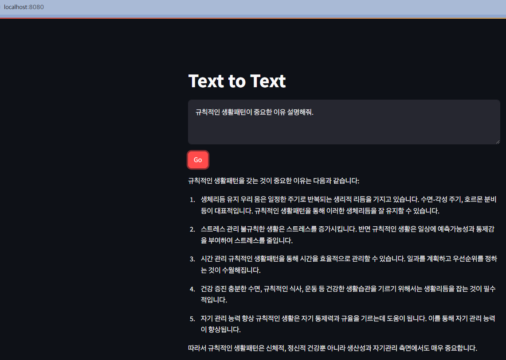

# 텍스트 생성

LangChain & Streamlit으로 간단한 텍스트 생성기 개발
사용자 입력을 수집 후 Bedrock에 전달하고 기초 모델의 응답 반환.

## 테스트

```zsh
❯ streamlit run text_app_kr.py --server.port 8080

  You can now view your Streamlit app in your browser.

  Local URL: http://localhost:8080
  Network URL: http://172.28.8.232:8080

gio: http://localhost:8080: Operation not supported
```

## 확인


