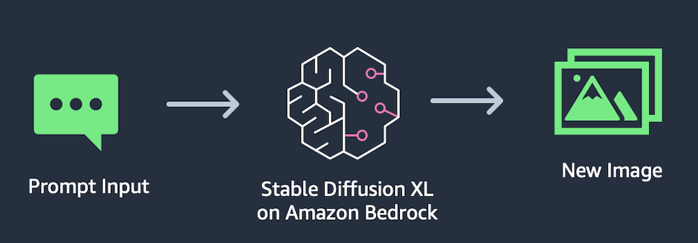
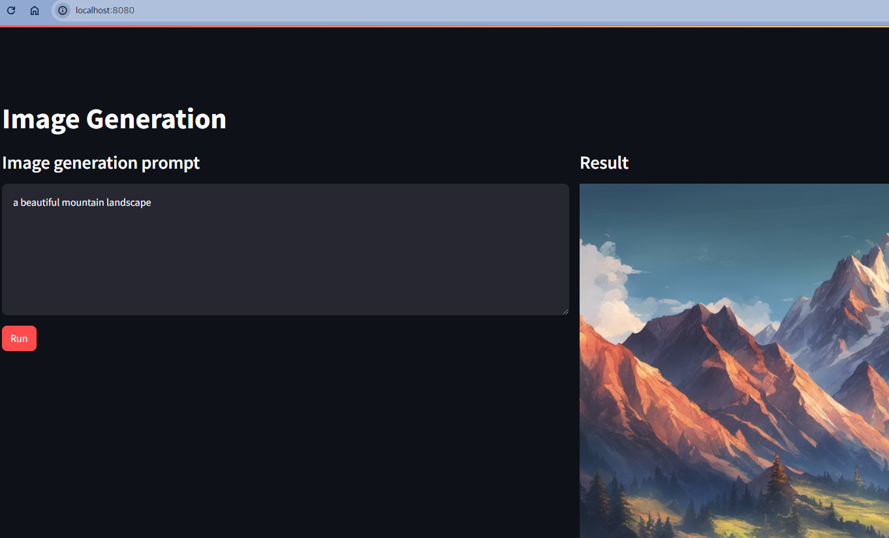

# 이미지 생성

Stable Diffusion, Bedrock, Streamlit을 사용한 이미지 생성기
Boto3 라이브러리를 사용하여 Stable Diffusion과 상호작용



## 테스트

```zsh
❯ streamlit run image_app_kr.py --server.port 8080

  You can now view your Streamlit app in your browser.

  Local URL: http://localhost:8080
  Network URL: http://172.28.8.232:8080

gio: http://localhost:8080: Operation not supported
```

## 확인

